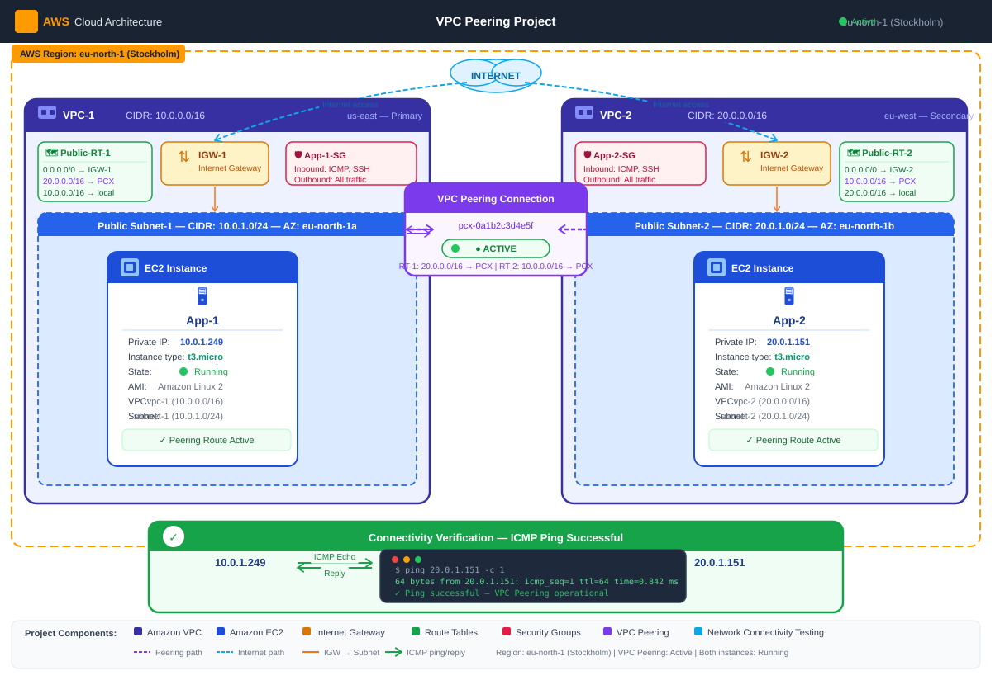

# 🚀 AWS VPC Peering Project

## 📖 Project Overview

This project demonstrates AWS VPC Peering between two custom Virtual Private Clouds (VPCs) using Amazon EC2 instances. The objective was to establish private communication between resources located in different VPCs and verify connectivity using ICMP (Ping).

---

## 🏗️ Architecture Diagram

---

## ⚙️ AWS Services Used

* Amazon VPC
* Amazon EC2
* Internet Gateway
* Route Tables
* Security Groups
* VPC Peering

---

## 🌐 Network Configuration

| Resource        | Configuration |
| --------------- | ------------- |
| VPC-1           | 10.0.0.0/16   |
| Public Subnet-1 | 10.0.1.0/24   |
| VPC-2           | 20.0.0.0/16   |
| Public Subnet-2 | 20.0.1.0/24   |
| EC2 Instances   | App-1 & App-2 |

---

## 🔄 Implementation Steps

1. Created two custom VPCs.
2. Created public subnets in each VPC.
3. Attached Internet Gateways.
4. Configured Route Tables.
5. Launched EC2 instances.
6. Created and accepted a VPC Peering connection.
7. Updated route tables with peering routes.
8. Configured Security Groups for SSH and ICMP traffic.
9. Verified connectivity between EC2 instances using Ping.

---

## 📸 Project Screenshots

### 🔗 VPC Peering Connection

### 🛣️ Route Table Configuration

### ✅ Connectivity Verification

---

## 🎯 Result

Successfully established communication between EC2 instances located in different VPCs through AWS VPC Peering using private IP addresses.

---

## 💡 Key Learnings

* VPC Design and Configuration
* Subnet Creation and Management
* Internet Gateway Configuration
* Route Table Management
* Security Group Configuration
* VPC Peering Setup
* EC2 Networking
* Network Connectivity Testing

---

## 👨‍💻 Author

**JenishRai Patel**

Cloud & DevOps Enthusiast ☁️
